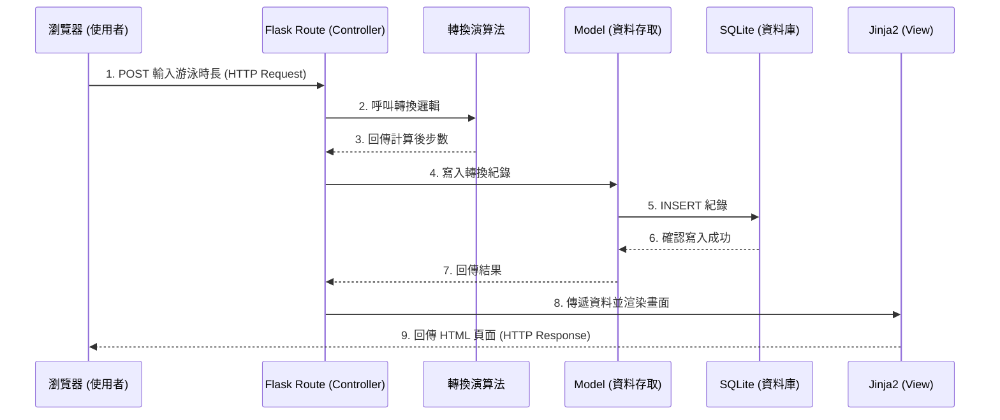

# 系統架構設計 (Architecture)

這份文件根據 `docs/PRD.md` 規劃了 **Pikmin Swim** 專案的系統架構，為後續的開發提供技術指引。

## 1. 技術架構說明

本專案採用傳統的伺服器端渲染 (Server-Side Rendering) 架構，不進行前後端分離，藉此快速開發並達成 MVP 目標。

### 選用技術與原因
- **後端框架：Flask (Python)** 
  - 輕量且靈活，適合快速開發中小型專案與建構核心步數轉換演算法。
- **模板引擎：Jinja2**
  - 完美整合於 Flask，可以將後端資料無縫嵌入 HTML，減少前端開發的複雜度。
- **資料庫：SQLite (透過 sqlite3 或 SQLAlchemy)**
  - 內建於 Python 且無需額外架設資料庫伺服器，對專案初期的使用者資料與運動紀錄儲存已經非常夠用。

### Flask MVC 模式說明
我們將採用類似 MVC（Model-View-Controller）的架構來組織程式碼：
- **Model (模型)**：負責與 SQLite 資料庫溝通，處理資料的讀寫與業務邏輯（如處理運動紀錄的存取）。
- **View (視圖)**：負責呈現給使用者的畫面，由 Jinja2 搭配 HTML/CSS 以及不同的海洋主題背景組成。
- **Controller (控制器)**：由 Flask 的路由 (Routes) 扮演，負責接收使用者的請求、呼叫步數轉換演算法、從 Model 取得資料，最後傳遞給 View 進行渲染。

---

## 2. 專案資料夾結構

專案將採取清晰的模組化結構，將模型、路由、模板與靜態資源分離。

```text
pikmin_swim/
├── app/                      ← 應用程式的主要目錄
│   ├── __init__.py           ← 初始化 Flask App 與設定
│   ├── models/               ← 資料庫模型 (Model)
│   │   └── user_record.py    ← 定義使用者與運動紀錄的資料表結構與操作
│   ├── routes/               ← Flask 路由 (Controller)
│   │   ├── main.py           ← 首頁與儀表板路由
│   │   ├── convert.py        ← 步數轉換核心邏輯路由
│   │   └── auth.py           ← 使用者登入/註冊路由
│   ├── templates/            ← Jinja2 HTML 模板 (View)
│   │   ├── base.html         ← 共用模板（導覽列、頁尾）
│   │   ├── index.html        ← 首頁/儀表板
│   │   ├── login.html        ← 登入/註冊頁面
│   │   └── convert.html      ← 輸入運動數據並顯示轉換結果的頁面
│   └── static/               ← 靜態資源 (CSS / JS / 圖片)
│       ├── css/
│       │   └── style.css     ← 主要樣式檔
│       ├── js/
│       │   └── main.js       ← 簡易的前端互動邏輯
│       └── images/           ← 海洋/水上主題背景圖片存放區
├── instance/                 ← 放置不進版本控制的實體資料
│   └── database.db           ← SQLite 資料庫檔案
├── docs/                     ← 開發文件目錄 (PRD, Architecture 等)
├── app.py                    ← 應用程式入口點，負責啟動伺服器
├── requirements.txt          ← Python 依賴套件清單
└── README.md                 ← 專案說明文件
```

---

## 3. 元件關係圖

以下展示了系統各元件在處理使用者請求時的互動關係：



---

## 4. 關鍵設計決策

1. **整合路由與演算法的設計**
   - **決策**：將步數核心轉換演算法獨立封裝為一個模組，由 `convert.py` 路由呼叫，而不是直接寫死在路由中。
   - **原因**：為了確保未來若轉換邏輯變更（例如支援不同泳姿有不同權重），可以單獨測試與修改演算法模組，而不影響 Web 路由。
2. **採用 Jinja2 處理背景切換邏輯**
   - **決策**：海洋主題背景的狀態透過後端傳遞變數給 Jinja2 模板，由模板根據變數動態套用對應的 CSS 類別。
   - **原因**：可以避免編寫複雜的 JavaScript 狀態管理，讓頁面渲染更直接，並且狀態可以隨使用者的偏好設定記錄在資料庫中。
3. **SQLite 資料庫存放於 `instance/` 資料夾**
   - **決策**：將 `database.db` 放在獨立的 `instance/` 目錄並將其加入 `.gitignore`（或只保存空架構）。
   - **原因**：避免將真實的使用者資料（包含密碼雜湊）上傳至公開或共用的 Git 儲存庫，增強系統安全性與隱私性。
