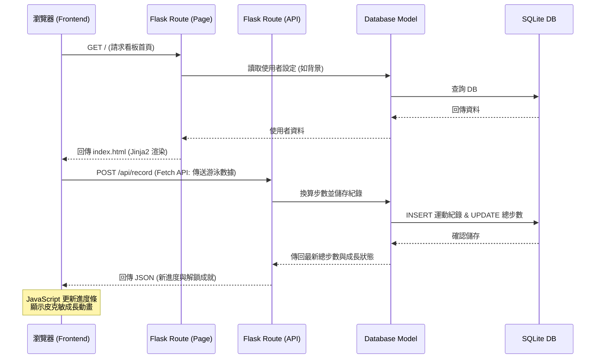

# 系統架構文件 (Architecture)：皮克敏水性類型運動換算步數系統

這份文件基於 [產品需求文件 (PRD)](PRD.md)，規劃了本專案的技術架構、資料夾結構與各個元件的職責分配。

## 1. 技術架構說明

本專案不採用前後端分離架構，而是採用以伺服器端渲染 (SSR) 為主的全端架構。
- **後端：Python + Flask**
  - **原因**：Flask 輕量且靈活，適合快速開發 MVP，並且能完美與 Jinja2 整合，快速實現路由與動態頁面渲染。
- **模板引擎：Jinja2**
  - **原因**：內建於 Flask，可直接將後端的運動數據與換算結果無縫注入到 HTML 結構中。
- **資料庫：SQLite**
  - **原因**：輕量化、零配置的關聯式資料庫，非常適合初期測試、第三方紀錄與模擬驗證的需求。
- **前端：HTML + CSS + 原生 JavaScript**
  - **原因**：無需導入龐大的前端框架，直接撰寫 CSS 進行高度美化（配合 AI 生成的海洋主題與皮克敏素材），並透過原生 JS 處理簡單的微動畫與使用者互動。

### MVC 模式對應
- **Model (模型)**：負責定義資料表結構（如：使用者資料、運動紀錄、步數換算規則）並處理 SQLite 的存取。
- **View (視圖)**：Jinja2 模板與靜態資源（CSS, JS, 圖片）。負責將 AI 生成的素材與換算後的步數結果，呈現給使用者。
- **Controller (控制器)**：Flask 的路由（Routes）。負責接收使用者的請求（例如：手動輸入運動數據），呼叫 Model 進行轉換計算與儲存，最後將結果交給 View 進行渲染。

## 2. 專案資料夾結構

專案將採取模組化的結構來分離關注點：

```text
pikmin_swim/
├── app/
│   ├── __init__.py      # Flask 應用程式初始化與配置
│   ├── models/          # 資料庫模型與存取邏輯 (Model)
│   │   ├── __init__.py
│   │   ├── user.py      # 使用者模型
│   │   └── activity.py  # 運動紀錄與步數換算邏輯
│   ├── routes/          # 路由控制器 (Controller)
│   │   ├── __init__.py
│   │   ├── main.py      # 主首頁、儀表板路由
│   │   └── api.py       # (可選) 接收手錶數據的 API 端點
│   ├── static/          # 靜態資源 (View)
│   │   ├── css/         # 樣式表 (海洋風主題美化)
│   │   ├── js/          # 互動腳本 (微動畫、圖表)
│   │   └── images/      # AI 生成的皮克敏與水下場景素材
│   └── templates/       # HTML Jinja2 模板 (View)
│       ├── base.html    # 共用版型 (Header, Footer, 導覽列)
│       ├── index.html   # 首頁 / 登入
│       ├── dashboard.html # 運動儀表板 (顯示步數與動畫)
│       └── record.html  # 運動數據手動輸入/上傳頁面
├── instance/
│   └── database.db      # SQLite 資料庫檔案 (不進版控)
├── docs/                # 專案文件 (PRD, 架構圖等)
├── .gitignore           # Git 忽略檔案清單
├── requirements.txt     # Python 依賴套件清單
└── app.py               # 專案啟動入口程式
```

## 3. 元件關係圖

以下展示使用者在瀏覽器操作時，系統各元件之間的互動流程：
# 系統架構設計：皮克敏水性類型運動換算步數系統

## 1. 技術架構說明
本專案採用經典的 Web 後端渲染架構，不採用前後端分離，確保開發流程單純、快速且易於維護，適合目前的 MVP 階段。

- **後端框架：Python + Flask**
  - **原因**：Flask 是輕量級框架，上手快、具備高度彈性，非常適合用來快速建立 API 介面與處理路由邏輯（如負責接收運動數據的 F-01 API）。
- **前端模板：Jinja2**
  - **原因**：Flask 內建支援 Jinja2，可在後端直接處理變數替換、條件邏輯與迴圈，將動態資料（如累積步數、換算紀錄）嵌入 HTML 中並渲染給瀏覽器。
- **資料庫：SQLite (搭配 sqlite3 或 SQLAlchemy)**
  - **原因**：無須額外架設資料庫伺服器，資料儲存於本地單一檔案，輕巧且足以應付初期規模的使用者資料與運動紀錄。

**MVC 模式說明**：
- **Model (模型)**：負責定義資料結構（例如 User、ActivityRecord）與資料庫互動，封裝步數換算邏輯等商業規則。
- **View (視圖)**：負責呈現資料給使用者，由 Jinja2 結合 HTML/CSS 構成介面。
- **Controller (控制器)**：由 Flask 的 Routes (路由) 負責，處理使用者的請求（接收 API 資料或頁面訪問）、調用 Model 處理資料，最後將資料傳遞給 View 進行渲染或直接回傳 JSON。

## 2. 專案資料夾結構

```text
pikmin_swim/
├── app/                        ← 主要應用程式目錄
│   ├── __init__.py             ← 初始化 Flask 應用程式
│   ├── models/                 ← 資料庫模型 (Model)
│   │   ├── __init__.py
│   │   ├── user.py             ← 使用者帳號模型
│   │   └── activity.py         ← 運動數據與換算紀錄模型
│   ├── routes/                 ← Flask 路由控制器 (Controller)
│   │   ├── __init__.py
│   │   ├── api.py              ← 處理穿戴裝置發送的運動數據 API (F-01)
│   │   ├── main.py             ← 網站主要頁面路由 (展示步數、個人紀錄)
│   │   └── auth.py             ← 處理註冊、登入邏輯
│   ├── templates/              ← Jinja2 HTML 模板 (View)
│   │   ├── base.html           ← 共用模板 (如導覽列)
│   │   ├── dashboard.html      ← 個人數據總覽與紀錄展示頁 (F-03)
│   │   └── login.html          ← 登入/註冊頁 (F-05)
│   └── static/                 ← CSS / JS 等靜態資源
│       ├── css/
│       │   └── style.css       ← 主要樣式表，包含個人化背景切換設定 (F-04)
│       ├── js/
│       │   └── main.js         ← 處理前端基礎互動
│       └── images/             ← 水性主題背景圖片資源
├── docs/                       ← 專案文件 (PRD, 架構圖等)
│   ├── PRD.md
│   └── ARCHITECTURE.md
├── instance/                   ← 存放本機開發機密或獨立資料庫
│   └── database.db             ← SQLite 資料庫檔案
├── app.py                      ← 系統啟動入口
├── requirements.txt            ← Python 依賴套件清單 (Flask 等)
└── README.md                   ← 專案說明
```

## 3. 元件關係圖

以下展示各元件在系統中如何互相溝通：

```mermaid
graph TD
    %% 角色
    Device[穿戴裝置 / 模擬器]
    Browser[玩家瀏覽器]

    %% 控制器
    subgraph Controller [Flask 路由 (Routes)]
        API_Route[API 路由 api.py]
        Page_Route[頁面路由 main.py]
    end

    %% 模型
    subgraph Model [資料庫模型 (Models)]
        Logic[步數換算邏輯 / 數據驗證]
        DB[(SQLite database.db)]
    end

    %% 視圖
    subgraph View [前端視圖 (Templates)]
        Jinja[Jinja2 模板]
    end

    %% API 數據流 (F-01)
    Device --"1. 發送 JSON 運動數據 (POST)"--> API_Route
    API_Route --"2. 驗證與解析"--> Logic
    Logic --"3. 換算步數並儲存"--> DB
    Logic -.-> API_Route
    API_Route --"4. 回傳成功狀態 (JSON)"--> Device

    %% 頁面訪問流
    Browser --"A. 請求查看數據頁面 (GET)"--> Page_Route
    Page_Route --"B. 查詢歷史紀錄"--> DB
    DB -.-> Page_Route
    Page_Route --"C. 傳送資料"--> Jinja
    Jinja --"D. 渲染完成的 HTML"--> Browser
```

## 4. 關鍵設計決策

1. **獨立 API 路由 (F-01 專屬設計)**
   - **決策**：將負責接收穿戴裝置資料的路由獨立成 `api.py`，與一般網站頁面路由 (`main.py`) 分開。
   - **原因**：因為 API 路由預期接收和回傳的是 JSON 格式，而非 HTML 頁面，獨立出來能提升維護性，且方便實作特定的 JSON 資料格式驗證與日後的擴展。

2. **步數換算邏輯封裝於 Model 之中 (F-02)**
   - **決策**：將水上運動換算為皮克敏步數的數學公式，實作在 `models/activity.py` 中，而非 Controller 裡。
   - **原因**：這屬於系統核心商業邏輯（Business Logic）。封裝在 Model 中能確保日後不管從網頁手動新增，還是透過 API 自動接收，都會經過一致的換算標準。

3. **背景切換透過 CSS class 控制 (F-04)**
   - **決策**：個人化水系背景將透過 Jinja2 在 `<body>` 標籤動態注入對應的 CSS class（如 `class="theme-pool"` 或 `class="theme-ocean"`）來實現。
   - **原因**：這種作法簡單且效能好，無須使用複雜的 JavaScript 框架，僅靠靜態圖片搭配樣式即可達成水性主題切換。
# 系統架構設計 (Architecture)

這份文件根據 `docs/PRD.md` 規劃了 **Pikmin Swim** 專案的系統架構，為後續的開發提供技術指引。

## 1. 技術架構說明

本專案採用傳統的伺服器端渲染 (Server-Side Rendering) 架構，不進行前後端分離，藉此快速開發並達成 MVP 目標。

### 選用技術與原因
- **後端框架：Flask (Python)** 
  - 輕量且靈活，適合快速開發中小型專案與建構核心步數轉換演算法。
- **模板引擎：Jinja2**
  - 完美整合於 Flask，可以將後端資料無縫嵌入 HTML，減少前端開發的複雜度。
- **資料庫：SQLite (透過 sqlite3 或 SQLAlchemy)**
  - 內建於 Python 且無需額外架設資料庫伺服器，對專案初期的使用者資料與運動紀錄儲存已經非常夠用。

### Flask MVC 模式說明
我們將採用類似 MVC（Model-View-Controller）的架構來組織程式碼：
- **Model (模型)**：負責與 SQLite 資料庫溝通，處理資料的讀寫與業務邏輯（如處理運動紀錄的存取）。
- **View (視圖)**：負責呈現給使用者的畫面，由 Jinja2 搭配 HTML/CSS 以及不同的海洋主題背景組成。
- **Controller (控制器)**：由 Flask 的路由 (Routes) 扮演，負責接收使用者的請求、呼叫步數轉換演算法、從 Model 取得資料，最後傳遞給 View 進行渲染。
# 系統架構設計 (System Architecture)

這份文件根據 PRD 描述的「皮克敏水性類型運動換算步數系統」需求，規劃了整體的技術架構、資料夾結構與元件之間的互動關係。

---
# 系統架構文件 (Architecture) - 皮克敏水性類型運動換算步數系統

## 1. 技術架構說明

### 選用技術與原因
- **後端框架：Python + Flask**
  輕量級且易於上手，非常適合快速打造中小型 Web 專案。它能輕鬆處理使用者的登入請求、表單提交，以及呼叫步數轉換邏輯。
- **模板引擎：Jinja2**
  與 Flask 完美整合的模板引擎。它負責將後端的資料（如使用者的歷史運動紀錄、轉換後的步數）動態渲染進 HTML 中，不需額外引入複雜的前端框架（如 React/Vue）就能做出豐富的介面。
- **資料庫：SQLite**
  內建於 Python 中，以單一檔案的形式存在。不需要繁瑣的資料庫伺服器架設步驟，極大降低了團隊開發與本地端測試的門檻。

### Flask MVC 模式說明
雖然 Flask 本身是微框架，但我們將採用類似 MVC (Model-View-Controller) 的架構來明確分工：
- **Model (資料模型)**：負責定義 SQLite 的資料表結構（使用者、運動紀錄、步數轉換紀錄），並實作負責存取資料庫的 CRUD 操作函數。
- **View (視圖)**：由 Jinja2 模板組成，包含系統的操作介面、表單，以及能客製化的皮克敏風格背景。
- **Controller (控制器/路由)**：由 Flask 的 Routes (`@app.route`) 擔任，負責接收從瀏覽器傳來的 HTTP 請求，調用步數換算邏輯與 Model，然後把處理結果交給 View 去渲染。

---

## 2. 專案資料夾結構

專案將採取清晰的模組化結構，將模型、路由、模板與靜態資源分離。

```text
pikmin_swim/
├── app/                      ← 應用程式的主要目錄
│   ├── __init__.py           ← 初始化 Flask App 與設定
│   ├── models/               ← 資料庫模型 (Model)
│   │   └── user_record.py    ← 定義使用者與運動紀錄的資料表結構與操作
│   ├── routes/               ← Flask 路由 (Controller)
│   │   ├── main.py           ← 首頁與儀表板路由
│   │   ├── convert.py        ← 步數轉換核心邏輯路由
│   │   └── auth.py           ← 使用者登入/註冊路由
│   ├── templates/            ← Jinja2 HTML 模板 (View)
│   │   ├── base.html         ← 共用模板（導覽列、頁尾）
│   │   ├── index.html        ← 首頁/儀表板
│   │   ├── login.html        ← 登入/註冊頁面
│   │   └── convert.html      ← 輸入運動數據並顯示轉換結果的頁面
│   └── static/               ← 靜態資源 (CSS / JS / 圖片)
│       ├── css/
│       │   └── style.css     ← 主要樣式檔
│       ├── js/
│       │   └── main.js       ← 簡易的前端互動邏輯
│       └── images/           ← 海洋/水上主題背景圖片存放區
├── instance/                 ← 放置不進版本控制的實體資料
│   └── database.db           ← SQLite 資料庫檔案
├── docs/                     ← 開發文件目錄 (PRD, Architecture 等)
├── app.py                    ← 應用程式入口點，負責啟動伺服器
├── requirements.txt          ← Python 依賴套件清單
└── README.md                 ← 專案說明文件
為了保持程式碼的整潔與好維護，我們將專案拆分成以下結構：

```text
pikmin_swim/
├── app/                      # 應用程式主要資料夾
│   ├── models/               # (Model) 資料庫模型與 CRUD 操作
│   │   ├── __init__.py
│   │   ├── user.py           # 使用者資料表管理
│   │   ├── record.py         # 運動紀錄與轉換紀錄管理
│   │   └── db_helper.py      # 資料庫連線與輔助函數
│   ├── routes/               # (Controller) Flask 路由與邏輯
│   │   ├── __init__.py
│   │   ├── auth.py           # 登入與註冊路由
│   │   ├── dashboard.py      # 歷史紀錄與主控台路由
│   │   └── convert.py        # 接收運動數據並呼叫換算引擎的路由
│   ├── templates/            # (View) Jinja2 HTML 模板
│   │   ├── base.html         # 包含共用導覽列與背景佈景設定的基礎模板
│   │   ├── index.html        # 首頁 / 登入頁
│   │   ├── dashboard.html    # 歷史紀錄列表頁
│   │   └── add_record.html   # 新增運動紀錄表單頁
│   ├── static/               # CSS / JS 靜態資源
│   │   ├── css/
│   │   │   └── style.css     # 客製化皮克敏風格樣式
│   │   ├── js/
│   │   │   └── main.js       # 處理簡單介面互動
│   │   └── images/           # 各種可替換的背景圖檔
│   └── utils/                # 輔助工具
│       └── step_converter.py # 步數轉換引擎核心演算法
├── instance/                 # 存放不會進版本控制的敏感或本地資料
│   └── database.db           # SQLite 本地端資料庫檔案
├── docs/                     # 專案文件 (PRD, 架構文件等)
├── .gitignore
├── requirements.txt          # Python 套件相依性清單
└── app.py                    # Flask 應用程式入口點
```

---

## 3. 元件關係圖

以下展示了系統各元件在處理使用者請求時的互動關係：

```mermaid
sequenceDiagram
    participant Browser as 瀏覽器 (使用者)
    participant Route as Flask Route (Controller)
    participant Model as Model (Python/SQLite)
    participant Template as Jinja2 Template (View)

    Browser->>Route: 1. 提交水上運動數據 (HTTP POST)
    Route->>Model: 2. 呼叫模型進行儲存與步數換算
    Model-->>Route: 3. 回傳換算結果與儲存狀態
    Route->>Template: 4. 傳遞步數結果與背景設定
    Template-->>Route: 5. 渲染帶有 AI 素材的 HTML
    Route-->>Browser: 6. 回傳完整的 HTML 頁面展示
    participant Algorithm as 轉換演算法
    participant Model as Model (資料存取)
    participant DB as SQLite (資料庫)
    participant Template as Jinja2 (View)

    Browser->>Route: 1. POST 輸入游泳時長 (HTTP Request)
    Route->>Algorithm: 2. 呼叫轉換邏輯
    Algorithm-->>Route: 3. 回傳計算後步數
    Route->>Model: 4. 寫入轉換紀錄
    Model->>DB: 5. INSERT 紀錄
    DB-->>Model: 6. 確認寫入成功
    Model-->>Route: 7. 回傳結果
    Route->>Template: 8. 傳遞資料並渲染畫面
    Template-->>Browser: 9. 回傳 HTML 頁面 (HTTP Response)
以下展示使用者在瀏覽器上的操作，是如何經過 Flask 路由，最終與資料庫和模板互動的流程：

```mermaid
flowchart TD
    Browser[瀏覽器 (使用者介面)]
    
    subgraph Controller
        Route[Flask Route (app.py / routes)]
        Converter[步數轉換引擎 (step_converter.py)]
    end

    subgraph Model
        SQLite[(SQLite 資料庫)]
        DBModel[資料模型與 CRUD (models/)]
    end

    subgraph View
        Jinja[Jinja2 HTML 模板 (templates/)]
    end

    %% 請求流程
    Browser -- "1. 提交運動紀錄表單 (POST)" --> Route
    Route -- "2. 呼叫轉換演算法" --> Converter
    Converter -- "3. 回傳計算後步數" --> Route
    Route -- "4. 呼叫新增功能" --> DBModel
    DBModel -- "5. 寫入資料" --> SQLite
    
    %% 渲染流程
    SQLite -. "6. 讀取歷史紀錄" .-> DBModel
    DBModel -. "7. 回傳紀錄列表" .-> Route
    Route -- "8. 傳遞資料與背景設定" --> Jinja
    Jinja -- "9. 渲染出 HTML 網頁" --> Browser
```

---

## 4. 關鍵設計決策

1. **整合路由與演算法的設計**
   - **決策**：將步數核心轉換演算法獨立封裝為一個模組，由 `convert.py` 路由呼叫，而不是直接寫死在路由中。
   - **原因**：為了確保未來若轉換邏輯變更（例如支援不同泳姿有不同權重），可以單獨測試與修改演算法模組，而不影響 Web 路由。
2. **採用 Jinja2 處理背景切換邏輯**
   - **決策**：海洋主題背景的狀態透過後端傳遞變數給 Jinja2 模板，由模板根據變數動態套用對應的 CSS 類別。
   - **原因**：可以避免編寫複雜的 JavaScript 狀態管理，讓頁面渲染更直接，並且狀態可以隨使用者的偏好設定記錄在資料庫中。
3. **SQLite 資料庫存放於 `instance/` 資料夾**
   - **決策**：將 `database.db` 放在獨立的 `instance/` 目錄並將其加入 `.gitignore`（或只保存空架構）。
   - **原因**：避免將真實的使用者資料（包含密碼雜湊）上傳至公開或共用的 Git 儲存庫，增強系統安全性與隱私性。
1. **採用伺服器端渲染 (SSR) 而非前後端分離**
   - **原因**：為了簡化架構並加快 MVP 的開發速度，不使用 React 或 Vue 等前端框架，而是讓 Flask 與 Jinja2 在後端直接產生完整的 HTML 頁面。這樣可以把重心放在核心邏輯（資料庫與步數轉換）的實作。
2. **獨立的步數轉換引擎模組 (`utils/step_converter.py`)**
   - **原因**：將水上運動（時間、距離、泳姿等）轉換為步數的演算法獨立抽離。未來如果演算法需要升級（例如給予不同泳姿不同的權重），只需要修改這個檔案即可，不會影響到路由和資料庫的結構。
3. **個人化背景設定存於使用者資料表**
   - **原因**：為了實現類似皮克敏介面的自訂背景需求，我們會在 User 的資料表中加入類似 `theme_preference` 的欄位。當使用者登入時，Jinja2 模板就會根據此欄位，動態載入對應的背景 CSS 或圖片，確保個人化體驗。
4. **資料庫讀寫的模組化封裝 (`models/`)**
   - **原因**：為了讓負責歷史紀錄與資料庫管理的成員能專注於開發，將所有的 `SELECT`, `INSERT`, `UPDATE`, `DELETE` (CRUD) 操作封裝在特定的 Python 類別或函數中。路由層不需要寫 SQL 語法，只需呼叫 `record.get_all_by_user()`，提高程式碼的安全性與可讀性。
  - **原因**：Flask 輕量且彈性高，非常適合用來快速開發中小型應用程式與 API。對於這個主要處理「數據換算」和「看板展示」的專案來說，不會有過多的效能負擔。
- **前端模板與渲染：Jinja2 + Vanilla JS (Fetch API)**
  - **原因**：由 Flask 搭配 Jinja2 處理初始的 HTML 頁面渲染（如基礎結構、樣式匯入），而看板中的「即時數據更新」與「進度條動畫」則透過前端的 Fetch API 向 Flask 請求 JSON 資料來動態更新。這樣可以達到畫面不閃爍、平順更新的體驗，符合「不需要前後端分離」的技術限制。
- **資料庫：SQLite**
  - **原因**：免安裝、輕量化，資料直接存放在本地檔案，對於 MVP 階段的個人運動紀錄查詢與儲存已十分足夠。

### Flask MVC 模式說明
本專案的設計概念對應了 MVC (Model-View-Controller) 架構：
- **Model（資料庫模型）**：負責與 SQLite 互動，定義與存取運動紀錄、使用者累積步數、解鎖的成就與背景設定。
- **View（視圖）**：使用 Jinja2 模板渲染 HTML 頁面，結合 CSS 提供與皮克敏風格相似的介面，以及透過 JavaScript 更新畫面。
- **Controller（控制器/路由）**：Flask 的 Routes 扮演控制器的角色，接收來自前端的 HTTP 請求（例如使用者提交游泳數據），呼叫 Model 進行邏輯運算與存檔，最後將結果回傳（渲染 View 或是回傳 JSON 給 Fetch API）。

## 2. 專案資料夾結構

建議的資料夾結構如下，以模組化方式分離職責：

```text
pikmin_swim/
├── app/
│   ├── __init__.py      # Flask 應用程式工廠，初始化 app 
│   ├── models/          # Model 模組
│   │   ├── __init__.py
│   │   └── database.py  # SQLite 資料表定義與操作邏輯 (如 User, Record)
│   ├── routes/          # Controller 模組
│   │   ├── __init__.py
│   │   ├── page.py      # 負責渲染 Jinja2 頁面的路由 (如首頁、歷史紀錄頁)
│   │   └── api.py       # 負責處理 Fetch API 請求的路由 (如上傳數據)
│   ├── templates/       # View 模組 (Jinja2 HTML 檔案)
│   │   ├── base.html    # 頁面共用佈局 (Layout)
│   │   ├── index.html   # 個人運動成就看板主頁
│   │   └── history.html # 歷史紀錄查詢頁
│   └── static/          # 前端靜態資源
│       ├── css/
│       │   └── style.css  # 皮克敏風格的樣式表
│       ├── js/
│       │   └── dashboard.js # 處理 Fetch API 呼叫、進度條動畫與背景切換
│       └── images/      # 存放背景圖、皮克敏成長圖示、成就徽章等
├── instance/
│   └── pikmin.db        # SQLite 資料庫檔案 (運行時自動產生)
├── docs/
│   ├── PRD.md           # 產品需求文件
│   └── ARCHITECTURE.md  # 系統架構文件 (本文)
├── requirements.txt     # Python 套件相依清單 (Flask 等)
└── app.py               # 專案入口點，啟動 Flask 伺服器
```

## 3. 元件關係圖

以下展示使用者在瀏覽器上操作時，系統各元件如何互動：



## 4. 關鍵設計決策

1. **依賴伺服器端渲染 (SSR)**
   - **原因**：使用 Flask + Jinja2 直接渲染頁面，降低了開發與部署的複雜度，無需額外維護龐大前端專案，也能快速整合後端計算好的步數呈現給玩家。
2. **獨立的步數換算引擎模組**
   - **原因**：未來不同水上運動（如游泳、水球、衝浪）轉換成步數的比例可能會不同。將「換算邏輯」獨立寫在 Model 或專屬模組裡，可以讓 Route 的程式碼保持乾淨，易於維護與擴充。
3. **靜態資源的集中管理與分離**
   - **原因**：因為專案極度重視「AI 圖像生成與 UI 美化」，將所有的 AI 素材統一放置於 `app/static/images/` 並依主題分類，有助於前端開發者快速替換與管理高質感的視覺資產。
4. **預留 API 路由端點 (`api.py`)**
   - **原因**：為了符合 MVP 中串接運動手錶的潛在需求，除了傳統的表單送出外，特別規劃獨立的 API 路由，方便未來接收 JSON 格式的第三方裝置數據。
1. **混合式渲染 (Hybrid Rendering) 提升使用者體驗**
   - **決策**：不採用完全的 SPA (單頁應用程式)，而是以 Jinja2 渲染主要框架，但在核心的「看板數據與進度條」使用 JavaScript Fetch API 來實作。
   - **原因**：這樣可以在保持 Flask 架構簡單的同時，讓進度條更新時畫面不會重整，增強類似遊戲中的即時互動感與沉浸感。
2. **數據換算邏輯封裝於後端**
   - **決策**：將「游泳距離/時間」轉換為「步數」的邏輯實作於 Flask 的 Controller/Model 中，而不是寫在前端 JavaScript。
   - **原因**：確保換算邏輯的安全性與一致性，未來若換算公式需要調整，只需修改後端程式碼即可，前端單純負責展示結果，也方便進行單元測試。
3. **圖片資源與背景的動態載入**
   - **決策**：皮克敏成長狀態圖示及不同背景圖存放在 `static/images/`，但在資料庫中僅儲存使用者選擇的背景檔名或 ID。前端透過 API 取得狀態後，用 JS 動態更改 CSS 的 background-image。
   - **原因**：能有效降低資料庫儲存負擔，並且可以輕易擴充新的背景主題與皮克敏圖示，不需更動資料表結構。
