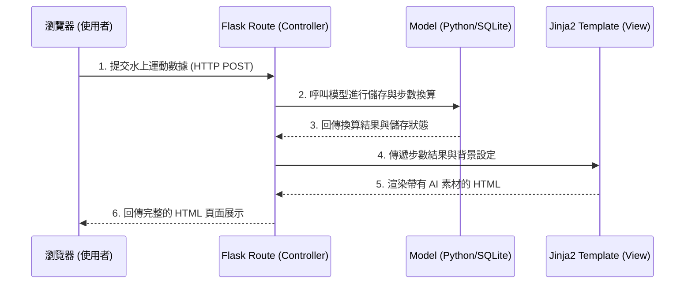

# 系統架構文件 (Architecture)：皮克敏水性類型運動換算步數系統

這份文件基於 [產品需求文件 (PRD)](PRD.md)，規劃了本專案的技術架構、資料夾結構與各個元件的職責分配。

## 1. 技術架構說明

本專案不採用前後端分離架構，而是採用以伺服器端渲染 (SSR) 為主的全端架構。
- **後端：Python + Flask**
  - **原因**：Flask 輕量且靈活，適合快速開發 MVP，並且能完美與 Jinja2 整合，快速實現路由與動態頁面渲染。
- **模板引擎：Jinja2**
  - **原因**：內建於 Flask，可直接將後端的運動數據與換算結果無縫注入到 HTML 結構中。
- **資料庫：SQLite**
  - **原因**：輕量化、零配置的關聯式資料庫，非常適合初期測試、第三方紀錄與模擬驗證的需求。
- **前端：HTML + CSS + 原生 JavaScript**
  - **原因**：無需導入龐大的前端框架，直接撰寫 CSS 進行高度美化（配合 AI 生成的海洋主題與皮克敏素材），並透過原生 JS 處理簡單的微動畫與使用者互動。

### MVC 模式對應
- **Model (模型)**：負責定義資料表結構（如：使用者資料、運動紀錄、步數換算規則）並處理 SQLite 的存取。
- **View (視圖)**：Jinja2 模板與靜態資源（CSS, JS, 圖片）。負責將 AI 生成的素材與換算後的步數結果，呈現給使用者。
- **Controller (控制器)**：Flask 的路由（Routes）。負責接收使用者的請求（例如：手動輸入運動數據），呼叫 Model 進行轉換計算與儲存，最後將結果交給 View 進行渲染。

## 2. 專案資料夾結構

專案將採取模組化的結構來分離關注點：

```text
pikmin_swim/
├── app/
│   ├── __init__.py      # Flask 應用程式初始化與配置
│   ├── models/          # 資料庫模型與存取邏輯 (Model)
│   │   ├── __init__.py
│   │   ├── user.py      # 使用者模型
│   │   └── activity.py  # 運動紀錄與步數換算邏輯
│   ├── routes/          # 路由控制器 (Controller)
│   │   ├── __init__.py
│   │   ├── main.py      # 主首頁、儀表板路由
│   │   └── api.py       # (可選) 接收手錶數據的 API 端點
│   ├── static/          # 靜態資源 (View)
│   │   ├── css/         # 樣式表 (海洋風主題美化)
│   │   ├── js/          # 互動腳本 (微動畫、圖表)
│   │   └── images/      # AI 生成的皮克敏與水下場景素材
│   └── templates/       # HTML Jinja2 模板 (View)
│       ├── base.html    # 共用版型 (Header, Footer, 導覽列)
│       ├── index.html   # 首頁 / 登入
│       ├── dashboard.html # 運動儀表板 (顯示步數與動畫)
│       └── record.html  # 運動數據手動輸入/上傳頁面
├── instance/
│   └── database.db      # SQLite 資料庫檔案 (不進版控)
├── docs/                # 專案文件 (PRD, 架構圖等)
├── .gitignore           # Git 忽略檔案清單
├── requirements.txt     # Python 依賴套件清單
└── app.py               # 專案啟動入口程式
```

## 3. 元件關係圖

以下展示使用者在瀏覽器操作時，系統各元件之間的互動流程：



## 4. 關鍵設計決策

1. **依賴伺服器端渲染 (SSR)**
   - **原因**：使用 Flask + Jinja2 直接渲染頁面，降低了開發與部署的複雜度，無需額外維護龐大前端專案，也能快速整合後端計算好的步數呈現給玩家。
2. **獨立的步數換算引擎模組**
   - **原因**：未來不同水上運動（如游泳、水球、衝浪）轉換成步數的比例可能會不同。將「換算邏輯」獨立寫在 Model 或專屬模組裡，可以讓 Route 的程式碼保持乾淨，易於維護與擴充。
3. **靜態資源的集中管理與分離**
   - **原因**：因為專案極度重視「AI 圖像生成與 UI 美化」，將所有的 AI 素材統一放置於 `app/static/images/` 並依主題分類，有助於前端開發者快速替換與管理高質感的視覺資產。
4. **預留 API 路由端點 (`api.py`)**
   - **原因**：為了符合 MVP 中串接運動手錶的潛在需求，除了傳統的表單送出外，特別規劃獨立的 API 路由，方便未來接收 JSON 格式的第三方裝置數據。
