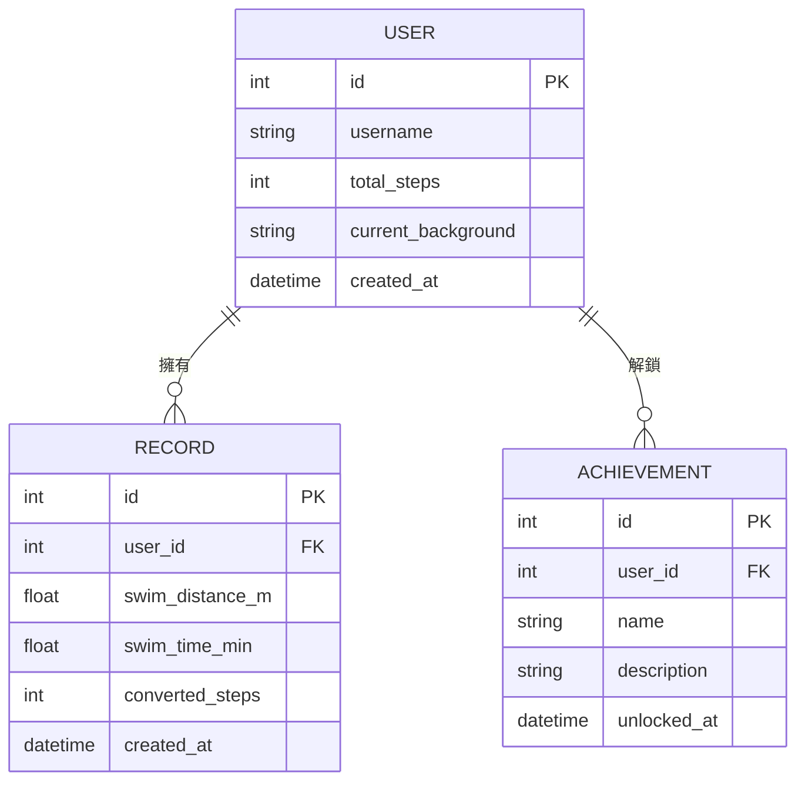

# 資料庫設計文件 (DB Design) - 皮克敏水性類型運動換算步數系統

這份文件定義了系統儲存資料的方式，包含實體關係圖（ER 圖）以及各資料表的詳細欄位說明。

## 1. ER 圖（實體關係圖）

## 2. 資料表詳細說明

### 2.1 USER (使用者)
儲存玩家的基本資料、目前總步數以及選擇的背景主題。
- `id` (INTEGER): 唯一識別碼，Primary Key。
- `username` (TEXT): 玩家名稱。
- `total_steps` (INTEGER): 玩家目前累計的轉換總步數（用來決定皮克敏等級）。
- `current_background` (TEXT): 目前設定的背景主題名稱（例如：'default', 'pool', 'ocean'）。
- `created_at` (DATETIME): 帳號建立時間。

### 2.2 RECORD (運動紀錄)
儲存玩家每一次轉換的游泳數據及轉換結果。
- `id` (INTEGER): 唯一識別碼，Primary Key。
- `user_id` (INTEGER): 對應的玩家識別碼，Foreign Key。
- `swim_distance_m` (REAL): 單次游泳距離（公尺）。
- `swim_time_min` (REAL): 單次游泳時間（分鐘）。
- `converted_steps` (INTEGER): 此次運動換算出的步數。
- `created_at` (DATETIME): 紀錄建立時間。

### 2.3 ACHIEVEMENT (成就)
紀錄玩家解鎖的特殊徽章或成就（例如：「累計游滿 10 公里」、「單日游 1000 公尺」等）。
- `id` (INTEGER): 唯一識別碼，Primary Key。
- `user_id` (INTEGER): 解鎖該成就的玩家，Foreign Key。
- `name` (TEXT): 成就名稱。
- `description` (TEXT): 成就的詳細說明。
- `unlocked_at` (DATETIME): 成就解鎖時間。

## 3. SQL 建表語法
完整的建表語法請參閱 `database/schema.sql` 檔案。

## 4. Python Model
透過 Python `sqlite3` 實作的 Model 位於 `app/models/` 目錄下：
- `user.py`
- `record.py`
- `achievement.py`
