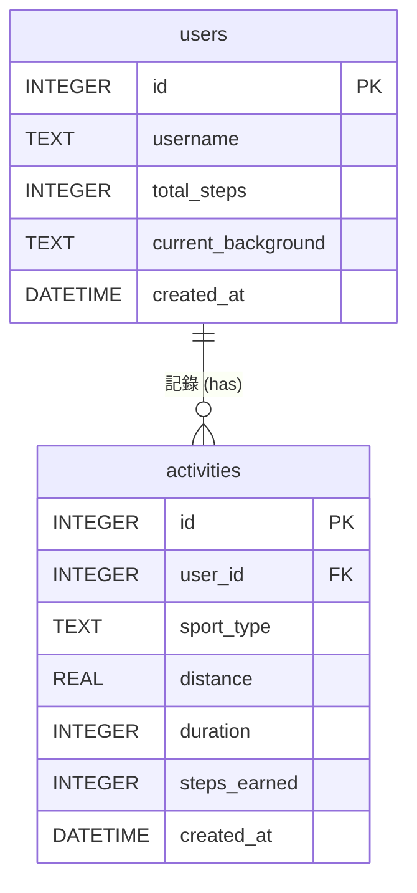
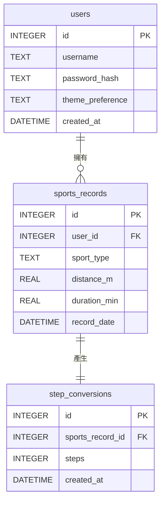
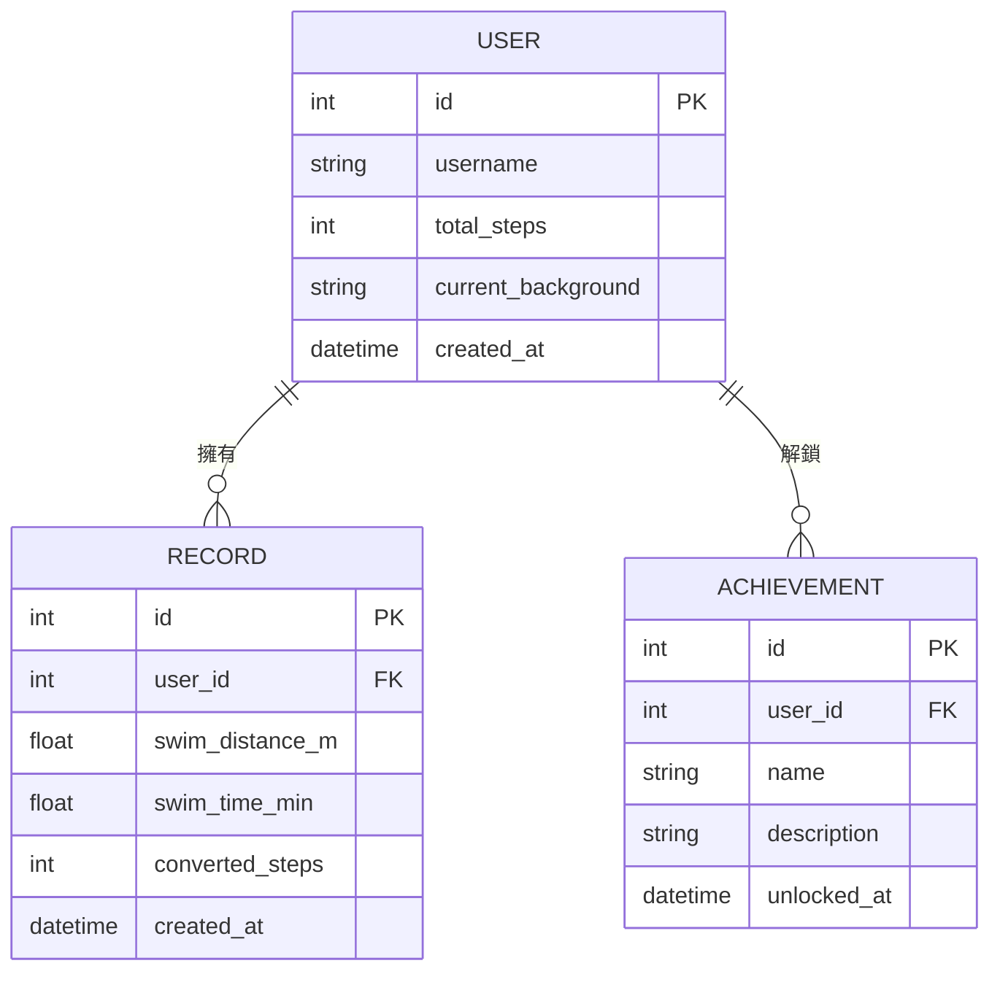

# 資料庫設計文件 (DB Design)：皮克敏水性類型運動換算步數系統

這份文件描述了系統所使用的 SQLite 資料庫設計，包含實體關係圖 (ER 圖) 與資料表詳細說明。

## 1. ER 圖（實體關係圖）



## 2. 資料表詳細說明

### 2.1 `users` 資料表
記錄使用者的基本資料、累積步數以及當前選擇的水下背景。

| 欄位名稱 | 型別 | 說明 | 是否必填 |
| --- | --- | --- | --- |
| `id` | INTEGER | Primary Key (Auto Increment) | 是 |
| `username` | TEXT | 使用者名稱 (需唯一) | 是 |
| `total_steps` | INTEGER | 目前累積的總步數 (預設為 0) | 是 |
| `current_background` | TEXT | 目前設定的背景主題名稱 (如：'ocean_default') | 否 |
| `created_at` | DATETIME | 帳號建立時間 (自動產生) | 是 |

### 2.2 `activities` 資料表
記錄使用者每次提交的水上運動數據，以及換算後獲得的步數。

| 欄位名稱 | 型別 | 說明 | 是否必填 |
| --- | --- | --- | --- |
| `id` | INTEGER | Primary Key (Auto Increment) | 是 |
| `user_id` | INTEGER | Foreign Key (對應 users.id) | 是 |
| `sport_type` | TEXT | 運動類型 (如：'swimming', 'water_polo', 'surfing') | 是 |
| `distance` | REAL | 運動距離 (單位：公尺/公里，視實作而定) | 否 |
| `duration` | INTEGER | 運動時間 (單位：分鐘) | 是 |
| `steps_earned` | INTEGER | 換算後獲得的步數 | 是 |
| `created_at` | DATETIME | 紀錄建立時間 (自動產生) | 是 |
# 資料庫設計：皮克敏水性類型運動換算步數系統

## 1. ER 圖（實體關係圖）

本系統主要包含兩個資料表：`users` (使用者) 與 `activities` (運動紀錄)。一個使用者可以擁有多筆運動紀錄，為「一對多」關係。

```mermaid
erDiagram
  USERS ||--o{ ACTIVITIES : "has"

  USERS {
    INTEGER id PK
    TEXT username
    TEXT email
    TEXT password_hash
    TEXT theme
    DATETIME created_at
  }

  ACTIVITIES {
    INTEGER id PK
    INTEGER user_id FK
    TEXT activity_type
    INTEGER duration_minutes
    REAL distance_meters
    INTEGER heart_rate_avg
    INTEGER converted_steps
    DATETIME recorded_at
    DATETIME created_at
  }
# 資料庫設計 (Database Design)

本文件描述 **Pikmin Swim** 專案的 SQLite 資料庫設計，包含實體關係圖 (ER 圖) 與詳細的資料表欄位定義。

## 1. 實體關係圖 (ER Diagram)

此專案目前設計了兩張主要的資料表：`users`（使用者）與 `swim_records`（游泳/步數轉換紀錄），兩者為「一對多 (One-to-Many)」的關聯。

```mermaid
erDiagram
    users ||--o{ swim_records : "擁有"
    users {
        int id PK
        string username
        string password_hash
        string preferred_background
        datetime created_at
    }
    swim_records {
        int id PK
        int user_id FK
        float swim_duration_minutes
        int stroke_count
        int converted_steps
        datetime created_at
    }
```

## 2. 資料表詳細說明

### 2.1 USERS (使用者資料表)
儲存使用者的基本帳號與個人化設定。

| 欄位名稱 | 型別 | 必填 | 說明 |
| :--- | :--- | :---: | :--- |
| `id` | INTEGER | 是 | Primary Key，自動遞增 |
| `username` | TEXT | 是 | 使用者顯示名稱 |
| `email` | TEXT | 是 | 登入用的電子信箱，必須唯一 |
| `password_hash` | TEXT | 是 | 經過加密雜湊的密碼 |
| `theme` | TEXT | 否 | 使用者選擇的個人化背景主題 (如 `ocean`, `pool`) |
| `created_at` | DATETIME | 是 | 帳號建立時間 (預設為當前時間) |

### 2.2 ACTIVITIES (運動紀錄資料表)
儲存從穿戴裝置接收到的原始運動數據以及換算後的步數。此為 **F-01** 與 **F-02** 功能的核心資料表。

| 欄位名稱 | 型別 | 必填 | 說明 |
| :--- | :--- | :---: | :--- |
| `id` | INTEGER | 是 | Primary Key，自動遞增 |
| `user_id` | INTEGER | 是 | Foreign Key，關聯至 `users.id` |
| `activity_type` | TEXT | 是 | 水上運動類型 (如 `swimming`, `diving`) |
| `duration_minutes` | INTEGER | 是 | 運動持續時間（分鐘） |
| `distance_meters` | REAL | 否 | 運動距離（公尺），某些運動可能無此數據 |
| `heart_rate_avg` | INTEGER | 否 | 平均心率，可作為換算參考 |
| `converted_steps` | INTEGER | 是 | 經過系統 F-02 公式換算後的皮克敏步數 |
| `recorded_at` | DATETIME | 是 | 穿戴裝置實際記錄的運動時間 |
| `created_at` | DATETIME | 是 | 系統接收並寫入資料庫的時間 |
### 2.1 `users` 資料表
儲存使用者的基本資訊與個人化設定（例如選擇的海洋背景）。

| 欄位名稱 | 型別 | 必填 | 說明 |
| --- | --- | --- | --- |
| `id` | INTEGER | 是 | Primary Key，自動遞增 |
| `username` | TEXT | 是 | 使用者帳號名稱，需唯一 |
| `password_hash` | TEXT | 是 | 經過雜湊處理的密碼 |
| `preferred_background`| TEXT | 否 | 使用者偏好的背景主題名稱（預設為 'default_ocean'）|
| `created_at` | DATETIME | 是 | 帳號建立時間（預設為當前時間） |

### 2.2 `swim_records` 資料表
儲存每次轉換游泳紀錄為步數的詳細數據。

| 欄位名稱 | 型別 | 必填 | 說明 |
| --- | --- | --- | --- |
| `id` | INTEGER | 是 | Primary Key，自動遞增 |
| `user_id` | INTEGER | 是 | Foreign Key，關聯至 `users(id)` |
| `swim_duration_minutes` | REAL | 否 | 游泳時長（分鐘），若純用划水次數可為 NULL |
| `stroke_count` | INTEGER | 否 | 划水次數，若純用時長計算可為 NULL |
| `converted_steps` | INTEGER | 是 | 經過演算法轉換後對應的陸上步數 |
| `created_at` | DATETIME | 是 | 紀錄建立時間（預設為當前時間） |

## 3. SQL 建表語法
完整的建表語法請參考專案中的 `database/schema.sql` 檔案。

## 4. Python Model
已採用 Python 內建的 `sqlite3` 模組撰寫對應的 CRUD Model，存放於：
- `app/models/user.py`
- `app/models/swim_record.py`
# 資料庫設計 (DB Design)

本文件根據 PRD 與系統架構，定義了「皮克敏水性類型運動換算步數系統」的 SQLite 資料表結構與實體關係圖 (ER 圖)。

---

## 1. ER 圖（實體關係圖）

系統包含三個主要的實體：使用者 (`users`)、運動紀錄 (`sports_records`) 與步數轉換紀錄 (`step_conversions`)。



---

## 2. 資料表詳細說明

### 2.1 `users` (使用者)
儲存使用者的基本資料與個人化設定。
- `id` (INTEGER): Primary Key，自動遞增。
- `username` (TEXT): 使用者帳號，必須填寫且唯一。
- `password_hash` (TEXT): 密碼的雜湊值，必須填寫以確保安全。
- `theme_preference` (TEXT): 儲存使用者選擇的背景主題，預設為 `default`。
- `created_at` (DATETIME): 帳號建立時間，預設為當前時間。

### 2.2 `sports_records` (運動紀錄)
儲存使用者輸入的水上運動數據。
- `id` (INTEGER): Primary Key，自動遞增。
- `user_id` (INTEGER): Foreign Key，關聯至 `users.id`，必填。
- `sport_type` (TEXT): 運動類型（例如：swimming），必填。
- `distance_m` (REAL): 運動距離（公尺）。
- `duration_min` (REAL): 運動時間（分鐘）。
- `record_date` (DATETIME): 紀錄發生的時間，預設為當前時間。

### 2.3 `step_conversions` (步數轉換紀錄)
儲存每筆運動紀錄對應的換算步數。
- `id` (INTEGER): Primary Key，自動遞增。
- `sports_record_id` (INTEGER): Foreign Key，關聯至 `sports_records.id`，必填。
- `steps` (INTEGER): 換算後的步數，必填。
- `created_at` (DATETIME): 轉換紀錄建立時間，預設為當前時間。

---

## 3. SQL 建表語法
完整的建表語法請參考 `database/schema.sql` 檔案。

---

## 4. Python Model 程式碼
系統使用原生的 `sqlite3` 模組操作資料庫，所有的 Model 都存放在 `app/models/` 目錄下：
- `db_helper.py`: 負責建立資料庫連線與初始化 Schema。
- `user.py`: 包含 User 類別的 CRUD 方法。
- `record.py`: 包含 SportsRecord 類別的 CRUD 方法。
- `conversion.py`: 包含 StepConversion 類別的 CRUD 方法。
# 資料庫設計文件 (DB Design) - 皮克敏水性類型運動換算步數系統

這份文件定義了系統儲存資料的方式，包含實體關係圖（ER 圖）以及各資料表的詳細欄位說明。

## 1. ER 圖（實體關係圖）



## 2. 資料表詳細說明

### 2.1 USER (使用者)
儲存玩家的基本資料、目前總步數以及選擇的背景主題。
- `id` (INTEGER): 唯一識別碼，Primary Key。
- `username` (TEXT): 玩家名稱。
- `total_steps` (INTEGER): 玩家目前累計的轉換總步數（用來決定皮克敏等級）。
- `current_background` (TEXT): 目前設定的背景主題名稱（例如：'default', 'pool', 'ocean'）。
- `created_at` (DATETIME): 帳號建立時間。

### 2.2 RECORD (運動紀錄)
儲存玩家每一次轉換的游泳數據及轉換結果。
- `id` (INTEGER): 唯一識別碼，Primary Key。
- `user_id` (INTEGER): 對應的玩家識別碼，Foreign Key。
- `swim_distance_m` (REAL): 單次游泳距離（公尺）。
- `swim_time_min` (REAL): 單次游泳時間（分鐘）。
- `converted_steps` (INTEGER): 此次運動換算出的步數。
- `created_at` (DATETIME): 紀錄建立時間。

### 2.3 ACHIEVEMENT (成就)
紀錄玩家解鎖的特殊徽章或成就（例如：「累計游滿 10 公里」、「單日游 1000 公尺」等）。
- `id` (INTEGER): 唯一識別碼，Primary Key。
- `user_id` (INTEGER): 解鎖該成就的玩家，Foreign Key。
- `name` (TEXT): 成就名稱。
- `description` (TEXT): 成就的詳細說明。
- `unlocked_at` (DATETIME): 成就解鎖時間。

## 3. SQL 建表語法
完整的建表語法請參閱 `database/schema.sql` 檔案。

## 4. Python Model
透過 Python `sqlite3` 實作的 Model 位於 `app/models/` 目錄下：
- `user.py`
- `record.py`
- `achievement.py`
