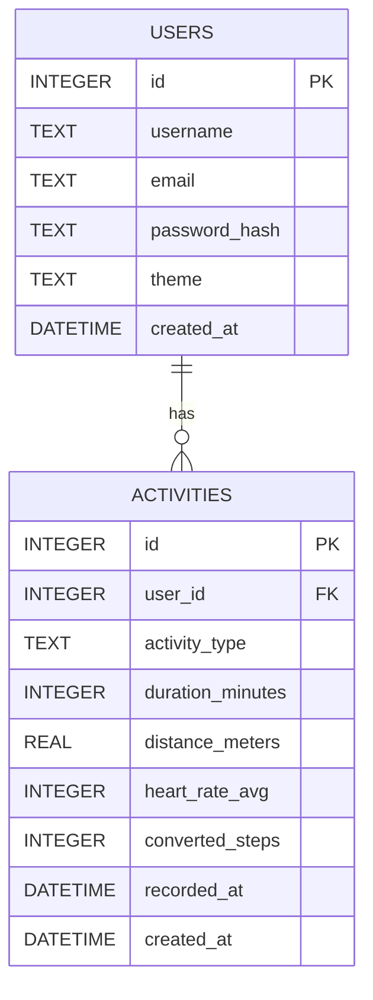

# 資料庫設計：皮克敏水性類型運動換算步數系統

## 1. ER 圖（實體關係圖）

本系統主要包含兩個資料表：`users` (使用者) 與 `activities` (運動紀錄)。一個使用者可以擁有多筆運動紀錄，為「一對多」關係。

## 2. 資料表詳細說明

### 2.1 USERS (使用者資料表)
儲存使用者的基本帳號與個人化設定。

| 欄位名稱 | 型別 | 必填 | 說明 |
| :--- | :--- | :---: | :--- |
| `id` | INTEGER | 是 | Primary Key，自動遞增 |
| `username` | TEXT | 是 | 使用者顯示名稱 |
| `email` | TEXT | 是 | 登入用的電子信箱，必須唯一 |
| `password_hash` | TEXT | 是 | 經過加密雜湊的密碼 |
| `theme` | TEXT | 否 | 使用者選擇的個人化背景主題 (如 `ocean`, `pool`) |
| `created_at` | DATETIME | 是 | 帳號建立時間 (預設為當前時間) |

### 2.2 ACTIVITIES (運動紀錄資料表)
儲存從穿戴裝置接收到的原始運動數據以及換算後的步數。此為 **F-01** 與 **F-02** 功能的核心資料表。

| 欄位名稱 | 型別 | 必填 | 說明 |
| :--- | :--- | :---: | :--- |
| `id` | INTEGER | 是 | Primary Key，自動遞增 |
| `user_id` | INTEGER | 是 | Foreign Key，關聯至 `users.id` |
| `activity_type` | TEXT | 是 | 水上運動類型 (如 `swimming`, `diving`) |
| `duration_minutes` | INTEGER | 是 | 運動持續時間（分鐘） |
| `distance_meters` | REAL | 否 | 運動距離（公尺），某些運動可能無此數據 |
| `heart_rate_avg` | INTEGER | 否 | 平均心率，可作為換算參考 |
| `converted_steps` | INTEGER | 是 | 經過系統 F-02 公式換算後的皮克敏步數 |
| `recorded_at` | DATETIME | 是 | 穿戴裝置實際記錄的運動時間 |
| `created_at` | DATETIME | 是 | 系統接收並寫入資料庫的時間 |
