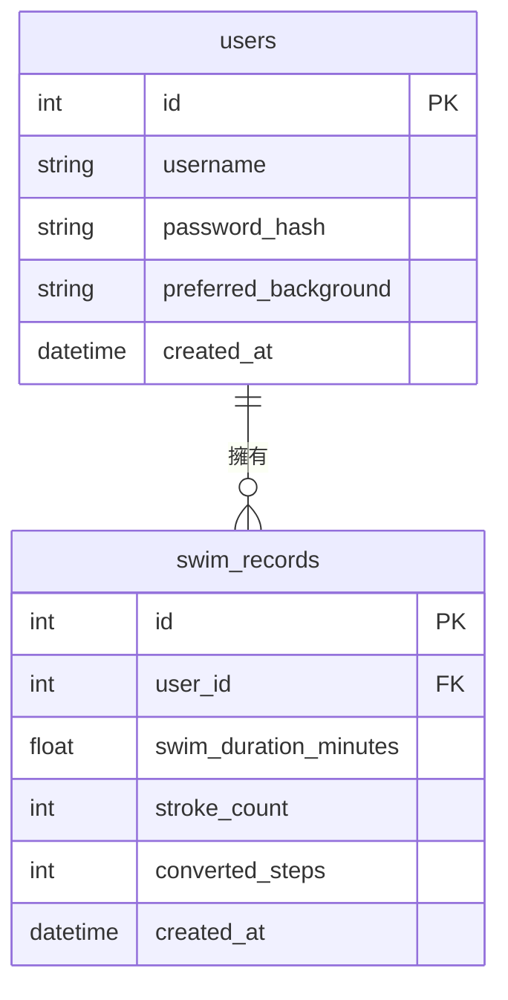

# 資料庫設計 (Database Design)

本文件描述 **Pikmin Swim** 專案的 SQLite 資料庫設計，包含實體關係圖 (ER 圖) 與詳細的資料表欄位定義。

## 1. 實體關係圖 (ER Diagram)

此專案目前設計了兩張主要的資料表：`users`（使用者）與 `swim_records`（游泳/步數轉換紀錄），兩者為「一對多 (One-to-Many)」的關聯。

## 2. 資料表詳細說明

### 2.1 `users` 資料表
儲存使用者的基本資訊與個人化設定（例如選擇的海洋背景）。

| 欄位名稱 | 型別 | 必填 | 說明 |
| --- | --- | --- | --- |
| `id` | INTEGER | 是 | Primary Key，自動遞增 |
| `username` | TEXT | 是 | 使用者帳號名稱，需唯一 |
| `password_hash` | TEXT | 是 | 經過雜湊處理的密碼 |
| `preferred_background`| TEXT | 否 | 使用者偏好的背景主題名稱（預設為 'default_ocean'）|
| `created_at` | DATETIME | 是 | 帳號建立時間（預設為當前時間） |

### 2.2 `swim_records` 資料表
儲存每次轉換游泳紀錄為步數的詳細數據。

| 欄位名稱 | 型別 | 必填 | 說明 |
| --- | --- | --- | --- |
| `id` | INTEGER | 是 | Primary Key，自動遞增 |
| `user_id` | INTEGER | 是 | Foreign Key，關聯至 `users(id)` |
| `swim_duration_minutes` | REAL | 否 | 游泳時長（分鐘），若純用划水次數可為 NULL |
| `stroke_count` | INTEGER | 否 | 划水次數，若純用時長計算可為 NULL |
| `converted_steps` | INTEGER | 是 | 經過演算法轉換後對應的陸上步數 |
| `created_at` | DATETIME | 是 | 紀錄建立時間（預設為當前時間） |

## 3. SQL 建表語法
完整的建表語法請參考專案中的 `database/schema.sql` 檔案。

## 4. Python Model
已採用 Python 內建的 `sqlite3` 模組撰寫對應的 CRUD Model，存放於：
- `app/models/user.py`
- `app/models/swim_record.py`
