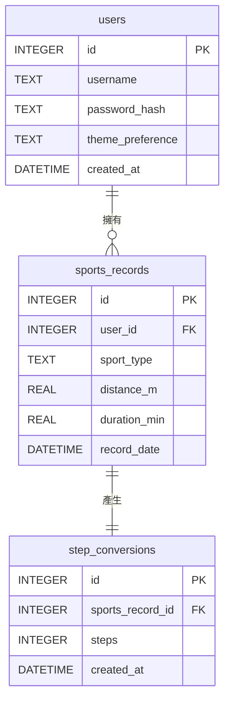

# 資料庫設計 (DB Design)

本文件根據 PRD 與系統架構，定義了「皮克敏水性類型運動換算步數系統」的 SQLite 資料表結構與實體關係圖 (ER 圖)。

---

## 1. ER 圖（實體關係圖）

系統包含三個主要的實體：使用者 (`users`)、運動紀錄 (`sports_records`) 與步數轉換紀錄 (`step_conversions`)。

---

## 2. 資料表詳細說明

### 2.1 `users` (使用者)
儲存使用者的基本資料與個人化設定。
- `id` (INTEGER): Primary Key，自動遞增。
- `username` (TEXT): 使用者帳號，必須填寫且唯一。
- `password_hash` (TEXT): 密碼的雜湊值，必須填寫以確保安全。
- `theme_preference` (TEXT): 儲存使用者選擇的背景主題，預設為 `default`。
- `created_at` (DATETIME): 帳號建立時間，預設為當前時間。

### 2.2 `sports_records` (運動紀錄)
儲存使用者輸入的水上運動數據。
- `id` (INTEGER): Primary Key，自動遞增。
- `user_id` (INTEGER): Foreign Key，關聯至 `users.id`，必填。
- `sport_type` (TEXT): 運動類型（例如：swimming），必填。
- `distance_m` (REAL): 運動距離（公尺）。
- `duration_min` (REAL): 運動時間（分鐘）。
- `record_date` (DATETIME): 紀錄發生的時間，預設為當前時間。

### 2.3 `step_conversions` (步數轉換紀錄)
儲存每筆運動紀錄對應的換算步數。
- `id` (INTEGER): Primary Key，自動遞增。
- `sports_record_id` (INTEGER): Foreign Key，關聯至 `sports_records.id`，必填。
- `steps` (INTEGER): 換算後的步數，必填。
- `created_at` (DATETIME): 轉換紀錄建立時間，預設為當前時間。

---

## 3. SQL 建表語法
完整的建表語法請參考 `database/schema.sql` 檔案。

---

## 4. Python Model 程式碼
系統使用原生的 `sqlite3` 模組操作資料庫，所有的 Model 都存放在 `app/models/` 目錄下：
- `db_helper.py`: 負責建立資料庫連線與初始化 Schema。
- `user.py`: 包含 User 類別的 CRUD 方法。
- `record.py`: 包含 SportsRecord 類別的 CRUD 方法。
- `conversion.py`: 包含 StepConversion 類別的 CRUD 方法。
