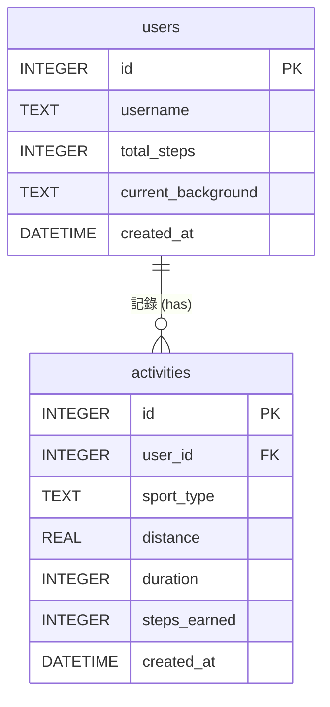

# 資料庫設計文件 (DB Design)：皮克敏水性類型運動換算步數系統

這份文件描述了系統所使用的 SQLite 資料庫設計，包含實體關係圖 (ER 圖) 與資料表詳細說明。

## 1. ER 圖（實體關係圖）

## 2. 資料表詳細說明

### 2.1 `users` 資料表
記錄使用者的基本資料、累積步數以及當前選擇的水下背景。

| 欄位名稱 | 型別 | 說明 | 是否必填 |
| --- | --- | --- | --- |
| `id` | INTEGER | Primary Key (Auto Increment) | 是 |
| `username` | TEXT | 使用者名稱 (需唯一) | 是 |
| `total_steps` | INTEGER | 目前累積的總步數 (預設為 0) | 是 |
| `current_background` | TEXT | 目前設定的背景主題名稱 (如：'ocean_default') | 否 |
| `created_at` | DATETIME | 帳號建立時間 (自動產生) | 是 |

### 2.2 `activities` 資料表
記錄使用者每次提交的水上運動數據，以及換算後獲得的步數。

| 欄位名稱 | 型別 | 說明 | 是否必填 |
| --- | --- | --- | --- |
| `id` | INTEGER | Primary Key (Auto Increment) | 是 |
| `user_id` | INTEGER | Foreign Key (對應 users.id) | 是 |
| `sport_type` | TEXT | 運動類型 (如：'swimming', 'water_polo', 'surfing') | 是 |
| `distance` | REAL | 運動距離 (單位：公尺/公里，視實作而定) | 否 |
| `duration` | INTEGER | 運動時間 (單位：分鐘) | 是 |
| `steps_earned` | INTEGER | 換算後獲得的步數 | 是 |
| `created_at` | DATETIME | 紀錄建立時間 (自動產生) | 是 |
