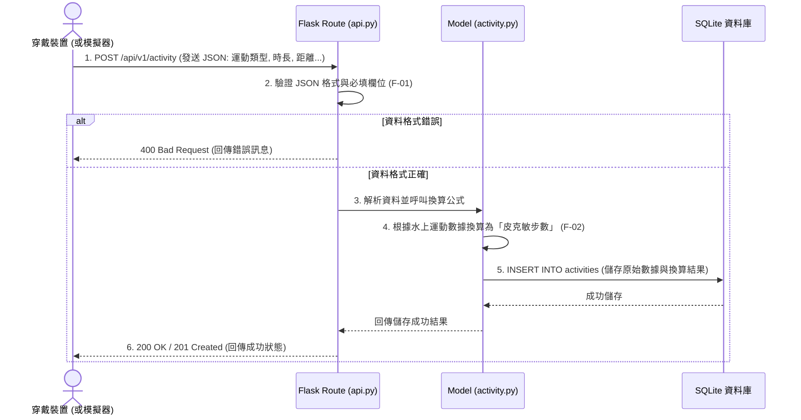
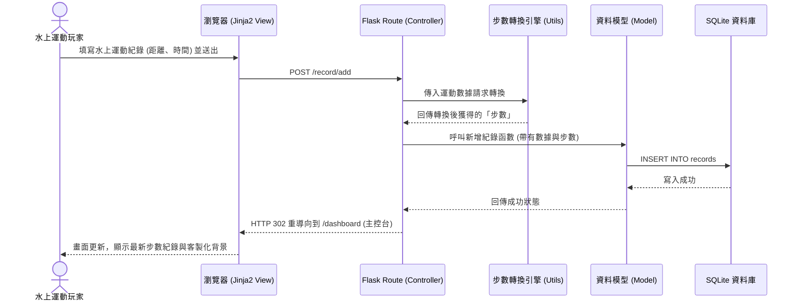
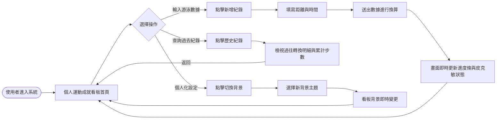
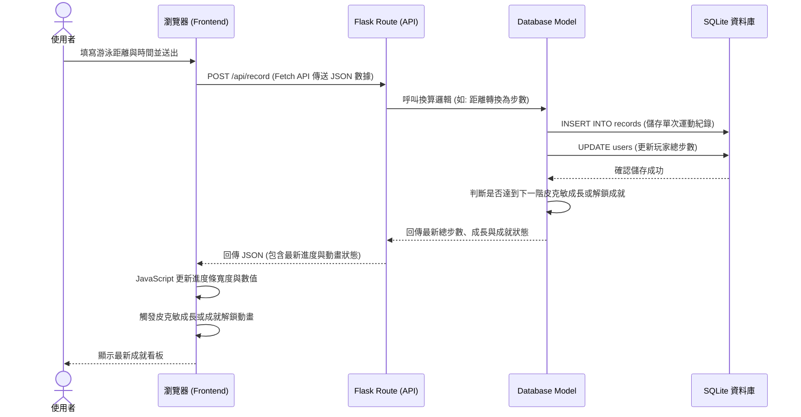

# 系統流程圖文件 (Flowchart)：皮克敏水性類型運動換算步數系統

這份文件基於 PRD 與架構設計，描繪了使用者的操作路徑與系統內部的資料流動。

## 1. 使用者流程圖 (User Flow)

這張圖展示了玩家從進入網站後，如何進行數據紀錄、查看儀表板與更換背景的操作路徑。

```mermaid
flowchart LR
    Start([玩家開啟網頁]) --> Home[首頁 / 登入]
    Home --> Dash[儀表板 (Dashboard)]
    
    Dash --> Action{選擇操作}
    
    Action -->|新增/匯入運動數據| AddRecord[進入紀錄頁面]
    AddRecord --> Form[填寫或上傳水上運動數據]
    Form --> Submit[送出數據]
    Submit -->|系統換算步數| Dash
    
    Action -->|更換水下背景| Settings[進入背景設定]
    Settings --> SelectBg[選擇 AI 生成場景]
    SelectBg --> Apply[套用背景]
    Apply --> Dash
    
    Action -->|查看歷史紀錄| History[進入歷史紀錄頁面]
    History --> Dash
# 流程圖設計：皮克敏水性類型運動換算步數系統

## 1. 使用者流程圖（User Flow）

此流程圖描述了「一般玩家」在前端網頁的操作路徑，以及「穿戴裝置」在背景傳送資料的流程。

```mermaid
flowchart LR
    %% 穿戴裝置的背景流程
    Device([穿戴裝置 / 模擬器]) -.->|1. 發送 JSON 數據| Sync[F-01 接收並同步運動數據]
    Sync -.->|2. F-02 換算為步數| DB[(資料庫)]

    %% 玩家前端操作流程
    Start([使用者開啟網頁]) --> CheckAuth{是否已登入？}
    CheckAuth -->|否| Login[登入 / 註冊頁面]
    Login -->|成功| CheckAuth
    CheckAuth -->|是| Dashboard[首頁 - 個人數據總覽]
    
    Dashboard --> Action{要執行什麼操作？}
    
    Action -->|查看紀錄| History[瀏覽歷史換算紀錄]
    History --> Dashboard
    
    Action -->|切換背景| Theme[設定頁 - 選擇水系主題背景]
    Theme -->|套用新背景| Dashboard
```

## 2. 系統序列圖（Sequence Diagram）

此序列圖詳細說明了您主要負責的核心功能：**F-01 運動數據接入 API 整合** 從接收到儲存的資料流動。



## 3. 功能清單對照表

根據 PRD 定義的 MVP 範圍，初步規劃的系統功能與對應的 HTTP 方法及預期路徑：

| 功能代號 | 功能說明 | HTTP 方法 | 對應的 URL 路徑 |
| :--- | :--- | :---: | :--- |
| **F-01** | **運動數據接入 API** | `POST` | `/api/v1/activity` |
| F-03 | 系統首頁 (個人數據總覽) | `GET` | `/` 或 `/dashboard` |
| F-04 | 更新個人化水系背景設定 | `POST` | `/settings/theme` |
| F-05 | 使用者登入頁面 | `GET` | `/login` |
| F-05 | 處理使用者登入驗證 | `POST` | `/login` |
| F-05 | 使用者登出 | `GET` / `POST`| `/logout` |

*(註：F-02 換算邏輯為後端內部呼叫的方法，並無直接對外的獨立路由，會在 F-01 接收數據時由 API 連帶呼叫。F-03 的歷史紀錄通常會直接隨首頁的 `GET /` 請求一同由 Jinja2 渲染。)*
# 流程圖設計 (Flowchart)

這份文件描述了 **Pikmin Swim** 專案的使用者流程與系統資料流，幫助開發團隊在實作前確認所有的操作路徑皆已完善規劃。

## 1. 使用者流程圖 (User Flow)

此圖展示了玩家從進入網站到完成轉換步數及更換背景的核心操作路徑。

```mermaid
flowchart LR
    Start([使用者開啟網頁]) --> Auth{是否已登入？}
    Auth -->|否| LoginPage[登入 / 註冊頁面]
    LoginPage -->|登入成功| Dashboard
    Auth -->|是| Dashboard[首頁 - 儀表板<br>(顯示累積步數與個人背景)]
    
    Dashboard --> Action{選擇操作}
    
    Action -->|新增運動紀錄| ConvertPage[輸入運動數據頁面]
    ConvertPage -->|填寫時長/頻率並送出| ProcessConvert[系統計算並儲存步數]
    ProcessConvert -->|成功| Dashboard
    
    Action -->|更換背景| BgPage[背景設定頁面]
    BgPage -->|選擇海洋主題| ProcessBg[系統更新使用者設定]
    ProcessBg -->|成功| Dashboard
    
    Action -->|查看紀錄| HistoryPage[歷史轉換紀錄清單]
    HistoryPage -->|返回| Dashboard
    
    Action -->|登出| Logout[登出系統]
    Logout --> LoginPage
```

## 2. 系統序列圖 (Sequence Diagram)

這張序列圖描述了玩家「送出水上運動數據」並「轉換為步數」的完整內部系統流程。

```mermaid
sequenceDiagram
    actor User as 水上運動玩家
    participant Browser as 瀏覽器 (前端 UI)
    participant Flask as Flask Route (控制器)
    participant Model as 換算引擎 (Model)
    participant DB as SQLite (資料庫)

    User->>Browser: 填寫水上運動數據 (如游泳距離)
    Browser->>Flask: POST /record (提交數據)
    Flask->>Model: 呼叫換算邏輯 (距離 -> 步數)
    Model-->>Flask: 取得換算後的步數結果
    Flask->>DB: INSERT 運動紀錄與獲得的步數
    DB-->>Flask: 寫入成功
    Flask-->>Browser: 重新導向至 /dashboard
    Browser-->>User: 顯示更新後的步數與皮克敏動畫
以下以「轉換游泳數據為步數」為例，展示從前端送出表單到後端計算與資料庫互動的完整生命週期。

```mermaid
sequenceDiagram
    actor User as 玩家
    participant Browser as 瀏覽器 (前端)
    participant Flask as Flask 路由 (convert.py)
    participant Algo as 轉換演算法模組
    participant DB as SQLite (資料庫)

    User->>Browser: 在表單輸入游泳時長並點擊「轉換」
    Browser->>Flask: POST /convert (帶有表單資料)
    Flask->>Algo: 呼叫轉換邏輯 (傳入時長參數)
    Algo-->>Flask: 回傳計算後對應的步數
    Flask->>DB: INSERT INTO user_records (存入步數與日期)
    DB-->>Flask: 寫入成功
    Flask->>Flask: 透過 Flash 訊息設定「轉換成功」提示
    Flask-->>Browser: HTTP 302 重導向回首頁 (/)
    Browser->>Flask: GET / (請求首頁)
    Flask->>DB: SELECT 獲取最新步數與設定
    DB-->>Flask: 回傳資料
    Flask-->>Browser: 渲染帶有最新步數的儀表板頁面
```

## 3. 功能清單與路由對照表

以下是專案初期預計實作的 URL 路由與對應功能的對照表，為後續 API 與頁面開發提供指引：

| 功能描述 | URL 路徑 | HTTP 方法 | 對應 Jinja2 模板 |
| --- | --- | --- | --- |
| 首頁 / 使用者登入 | `/` | `GET`, `POST` | `index.html` |
| 運動儀表板 (顯示步數與動畫) | `/dashboard` | `GET` | `dashboard.html` |
| 運動數據輸入/上傳頁面 | `/record` | `GET` | `record.html` |
| 處理運動數據提交與步數換算 | `/record` | `POST` | (Redirect 至 `/dashboard`) |
| 歷史紀錄清單 | `/history` | `GET` | `history.html` |
| 切換水下場景背景設定 | `/settings/background` | `POST` | (Redirect 或 AJAX 更新) |
| (預留) 接收外部手錶數據 API | `/api/sync` | `POST` | (回傳 JSON) |

在接下來的實作中，我們將需要完成以下核心路由（Routes）與對應的方法：

| 功能名稱 | URL 路徑 | HTTP 方法 | 說明 |
| --- | --- | --- | --- |
| 註冊帳號 | `/register` | GET, POST | 顯示註冊表單(GET)，處理註冊邏輯(POST) |
| 登入系統 | `/login` | GET, POST | 顯示登入表單(GET)，驗證帳號密碼(POST) |
| 登出系統 | `/logout` | GET | 清除 Session 並導回登入頁 |
| 首頁 / 儀表板 | `/` | GET | 顯示累積步數、今日步數、歷史圖表及當前背景 |
| 轉換運動步數 | `/convert` | GET, POST | 顯示輸入表單(GET)，執行轉換演算法與存檔(POST) |
| 歷史紀錄列表 | `/history` | GET | 檢視過去的所有轉換紀錄 |
| 切換背景設定 | `/background` | POST | 接收使用者選擇的背景選項並更新資料庫設定 |
# 系統與使用者流程圖 (Flowcharts)

這份文件基於 PRD 與系統架構文件，視覺化了「皮克敏水性類型運動換算步數系統」的使用者操作路徑（User Flow）以及資料庫存取流程（Sequence Diagram）。

---

## 1. 使用者流程圖 (User Flow)

這張圖描述了使用者從開啟網頁開始，如何在系統內導覽、登入、新增運動紀錄，以及變更背景主題的完整操作路徑。


---

## 2. 系統序列圖 (Sequence Diagram)

這張序列圖具體描述了使用者執行**「新增運動紀錄」**時，從前端瀏覽器、後端路由、步數轉換引擎、到最後將資料寫入 SQLite 資料庫的完整技術資料流。



---

## 3. 功能清單對照表

根據上述流程圖，初步規劃的各功能對應 URL 與 HTTP 方法：

| 功能名稱 | URL 路徑 | HTTP 方法 | 說明 |
| :--- | :--- | :--- | :--- |
| **登入頁面與處理** | `/login` | GET / POST | GET: 顯示登入表單<br>POST: 驗證帳號密碼並建立 Session |
| **註冊頁面與處理** | `/register` | GET / POST | GET: 顯示註冊表單<br>POST: 建立新使用者並寫入資料庫 |
| **登出處理** | `/logout` | GET | 清除使用者 Session 並導回登入頁 |
| **個人主控台** | `/dashboard` | GET | 顯示目前累計步數、歷史運動紀錄列表與客製化背景 |
| **新增運動紀錄** | `/record/add` | GET / POST | GET: 顯示水上運動填寫表單<br>POST: 接收表單資料、呼叫轉換引擎並寫入 DB |
| **變更背景主題** | `/settings/theme`| POST | 接收使用者選擇的新主題，更新 User 表格內的偏好設定 |
# 流程圖文件 (Flowchart) - 皮克敏水性類型運動換算步數系統

這份文件說明了使用者的操作流程（User Flow）、系統處理資料的序列圖（Sequence Diagram），以及對應的系統功能清單。

## 1. 使用者流程圖（User Flow）

描述使用者進入系統後，可以進行的操作與頁面轉換路徑。



## 2. 系統序列圖（Sequence Diagram）

描述最核心的「使用者輸入數據並更新看板」的背後運作流程。



## 3. 功能清單對照表

以下為系統中各主要功能與對應的路由設計：

| 功能名稱 | URL 路徑 | HTTP 方法 | 說明 |
| --- | --- | --- | --- |
| **顯示看板首頁** | `/` | `GET` | 透過 Jinja2 渲染個人運動成就看板，包含使用者當前的步數狀態、選擇的背景與皮克敏圖示。 |
| **顯示歷史紀錄頁** | `/history` | `GET` | 透過 Jinja2 渲染歷史運動紀錄清單頁面，讓玩家回顧過去的運動轉換明細。 |
| **送出運動數據** | `/api/record` | `POST` | 接收前端傳來的游泳數據，換算為步數並儲存至資料庫，回傳最新的狀態 JSON 給前端更新畫面。 |
| **切換背景設定** | `/api/background` | `POST` | 接收前端選擇的背景主題，更新資料庫中的使用者設定，並回傳確認訊息。 |
| **取得最新狀態** | `/api/status` | `GET` | 提供前端透過 AJAX 取得目前最新總步數與狀態的介面（用於重新整理或其他非同步需求）。 |
