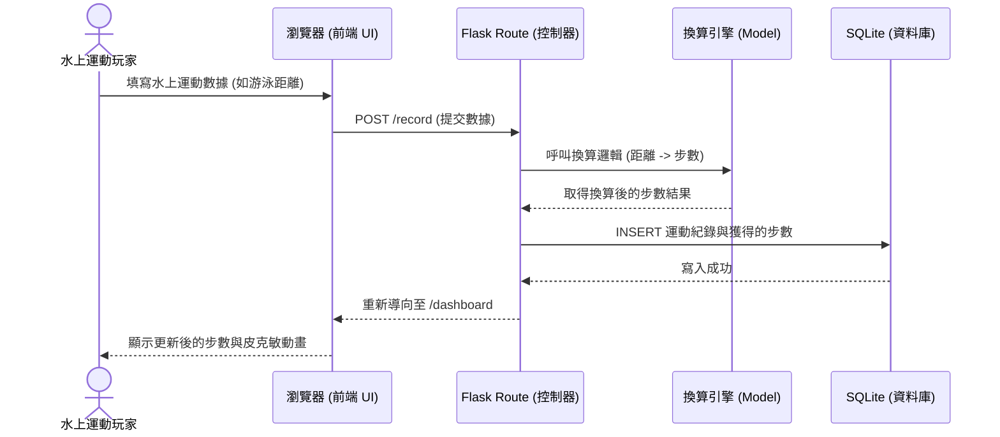

# 系統流程圖文件 (Flowchart)：皮克敏水性類型運動換算步數系統

這份文件基於 PRD 與架構設計，描繪了使用者的操作路徑與系統內部的資料流動。

## 1. 使用者流程圖 (User Flow)

這張圖展示了玩家從進入網站後，如何進行數據紀錄、查看儀表板與更換背景的操作路徑。

```mermaid
flowchart LR
    Start([玩家開啟網頁]) --> Home[首頁 / 登入]
    Home --> Dash[儀表板 (Dashboard)]
    
    Dash --> Action{選擇操作}
    
    Action -->|新增/匯入運動數據| AddRecord[進入紀錄頁面]
    AddRecord --> Form[填寫或上傳水上運動數據]
    Form --> Submit[送出數據]
    Submit -->|系統換算步數| Dash
    
    Action -->|更換水下背景| Settings[進入背景設定]
    Settings --> SelectBg[選擇 AI 生成場景]
    SelectBg --> Apply[套用背景]
    Apply --> Dash
    
    Action -->|查看歷史紀錄| History[進入歷史紀錄頁面]
    History --> Dash
```

## 2. 系統序列圖 (Sequence Diagram)

這張序列圖描述了玩家「送出水上運動數據」並「轉換為步數」的完整內部系統流程。



## 3. 功能清單與路由對照表

以下是專案初期預計實作的 URL 路由與對應功能的對照表，為後續 API 與頁面開發提供指引：

| 功能描述 | URL 路徑 | HTTP 方法 | 對應 Jinja2 模板 |
| --- | --- | --- | --- |
| 首頁 / 使用者登入 | `/` | `GET`, `POST` | `index.html` |
| 運動儀表板 (顯示步數與動畫) | `/dashboard` | `GET` | `dashboard.html` |
| 運動數據輸入/上傳頁面 | `/record` | `GET` | `record.html` |
| 處理運動數據提交與步數換算 | `/record` | `POST` | (Redirect 至 `/dashboard`) |
| 歷史紀錄清單 | `/history` | `GET` | `history.html` |
| 切換水下場景背景設定 | `/settings/background` | `POST` | (Redirect 或 AJAX 更新) |
| (預留) 接收外部手錶數據 API | `/api/sync` | `POST` | (回傳 JSON) |

