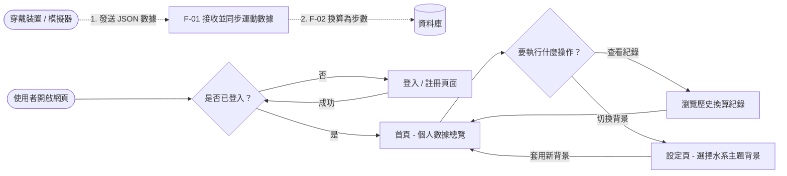
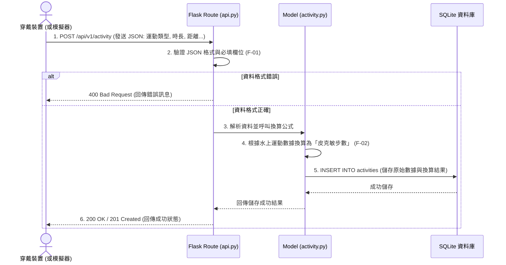

# 流程圖設計：皮克敏水性類型運動換算步數系統

## 1. 使用者流程圖（User Flow）

此流程圖描述了「一般玩家」在前端網頁的操作路徑，以及「穿戴裝置」在背景傳送資料的流程。

## 2. 系統序列圖（Sequence Diagram）

此序列圖詳細說明了您主要負責的核心功能：**F-01 運動數據接入 API 整合** 從接收到儲存的資料流動。

## 3. 功能清單對照表

根據 PRD 定義的 MVP 範圍，初步規劃的系統功能與對應的 HTTP 方法及預期路徑：

| 功能代號 | 功能說明 | HTTP 方法 | 對應的 URL 路徑 |
| :--- | :--- | :---: | :--- |
| **F-01** | **運動數據接入 API** | `POST` | `/api/v1/activity` |
| F-03 | 系統首頁 (個人數據總覽) | `GET` | `/` 或 `/dashboard` |
| F-04 | 更新個人化水系背景設定 | `POST` | `/settings/theme` |
| F-05 | 使用者登入頁面 | `GET` | `/login` |
| F-05 | 處理使用者登入驗證 | `POST` | `/login` |
| F-05 | 使用者登出 | `GET` / `POST`| `/logout` |

*(註：F-02 換算邏輯為後端內部呼叫的方法，並無直接對外的獨立路由，會在 F-01 接收數據時由 API 連帶呼叫。F-03 的歷史紀錄通常會直接隨首頁的 `GET /` 請求一同由 Jinja2 渲染。)*
