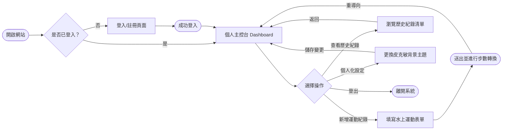
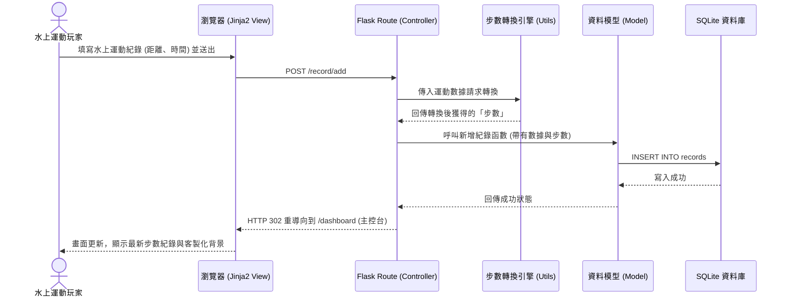

# 系統與使用者流程圖 (Flowcharts)

這份文件基於 PRD 與系統架構文件，視覺化了「皮克敏水性類型運動換算步數系統」的使用者操作路徑（User Flow）以及資料庫存取流程（Sequence Diagram）。

---

## 1. 使用者流程圖 (User Flow)

這張圖描述了使用者從開啟網頁開始，如何在系統內導覽、登入、新增運動紀錄，以及變更背景主題的完整操作路徑。

---

## 2. 系統序列圖 (Sequence Diagram)

這張序列圖具體描述了使用者執行**「新增運動紀錄」**時，從前端瀏覽器、後端路由、步數轉換引擎、到最後將資料寫入 SQLite 資料庫的完整技術資料流。

---

## 3. 功能清單對照表

根據上述流程圖，初步規劃的各功能對應 URL 與 HTTP 方法：

| 功能名稱 | URL 路徑 | HTTP 方法 | 說明 |
| :--- | :--- | :--- | :--- |
| **登入頁面與處理** | `/login` | GET / POST | GET: 顯示登入表單 POST: 驗證帳號密碼並建立 Session |
| **註冊頁面與處理** | `/register` | GET / POST | GET: 顯示註冊表單 POST: 建立新使用者並寫入資料庫 |
| **登出處理** | `/logout` | GET | 清除使用者 Session 並導回登入頁 |
| **個人主控台** | `/dashboard` | GET | 顯示目前累計步數、歷史運動紀錄列表與客製化背景 |
| **新增運動紀錄** | `/record/add` | GET / POST | GET: 顯示水上運動填寫表單 POST: 接收表單資料、呼叫轉換引擎並寫入 DB |
| **變更背景主題** | `/settings/theme`| POST | 接收使用者選擇的新主題，更新 User 表格內的偏好設定 |
