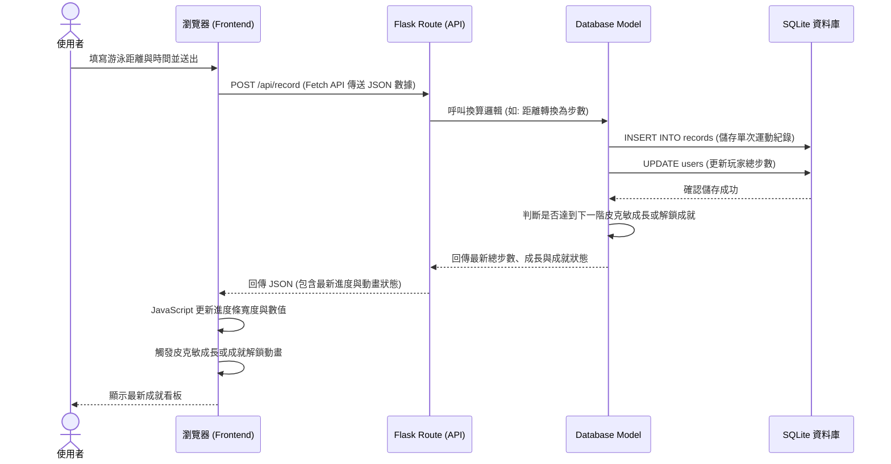

# 流程圖文件 (Flowchart) - 皮克敏水性類型運動換算步數系統

這份文件說明了使用者的操作流程（User Flow）、系統處理資料的序列圖（Sequence Diagram），以及對應的系統功能清單。

## 1. 使用者流程圖（User Flow）

描述使用者進入系統後，可以進行的操作與頁面轉換路徑。

## 2. 系統序列圖（Sequence Diagram）

描述最核心的「使用者輸入數據並更新看板」的背後運作流程。

## 3. 功能清單對照表

以下為系統中各主要功能與對應的路由設計：

| 功能名稱 | URL 路徑 | HTTP 方法 | 說明 |
| --- | --- | --- | --- |
| **顯示看板首頁** | `/` | `GET` | 透過 Jinja2 渲染個人運動成就看板，包含使用者當前的步數狀態、選擇的背景與皮克敏圖示。 |
| **顯示歷史紀錄頁** | `/history` | `GET` | 透過 Jinja2 渲染歷史運動紀錄清單頁面，讓玩家回顧過去的運動轉換明細。 |
| **送出運動數據** | `/api/record` | `POST` | 接收前端傳來的游泳數據，換算為步數並儲存至資料庫，回傳最新的狀態 JSON 給前端更新畫面。 |
| **切換背景設定** | `/api/background` | `POST` | 接收前端選擇的背景主題，更新資料庫中的使用者設定，並回傳確認訊息。 |
| **取得最新狀態** | `/api/status` | `GET` | 提供前端透過 AJAX 取得目前最新總步數與狀態的介面（用於重新整理或其他非同步需求）。 |
