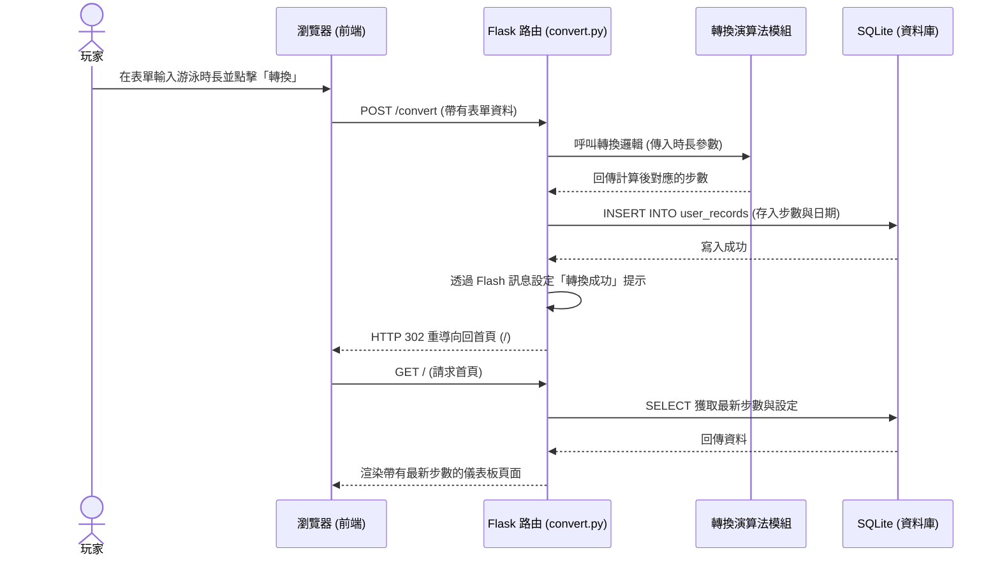

# 流程圖設計 (Flowchart)

這份文件描述了 **Pikmin Swim** 專案的使用者流程與系統資料流，幫助開發團隊在實作前確認所有的操作路徑皆已完善規劃。

## 1. 使用者流程圖 (User Flow)

此圖展示了玩家從進入網站到完成轉換步數及更換背景的核心操作路徑。

```mermaid
flowchart LR
    Start([使用者開啟網頁]) --> Auth{是否已登入？}
    Auth -->|否| LoginPage[登入 / 註冊頁面]
    LoginPage -->|登入成功| Dashboard
    Auth -->|是| Dashboard[首頁 - 儀表板<br>(顯示累積步數與個人背景)]
    
    Dashboard --> Action{選擇操作}
    
    Action -->|新增運動紀錄| ConvertPage[輸入運動數據頁面]
    ConvertPage -->|填寫時長/頻率並送出| ProcessConvert[系統計算並儲存步數]
    ProcessConvert -->|成功| Dashboard
    
    Action -->|更換背景| BgPage[背景設定頁面]
    BgPage -->|選擇海洋主題| ProcessBg[系統更新使用者設定]
    ProcessBg -->|成功| Dashboard
    
    Action -->|查看紀錄| HistoryPage[歷史轉換紀錄清單]
    HistoryPage -->|返回| Dashboard
    
    Action -->|登出| Logout[登出系統]
    Logout --> LoginPage
```

## 2. 系統序列圖 (Sequence Diagram)

以下以「轉換游泳數據為步數」為例，展示從前端送出表單到後端計算與資料庫互動的完整生命週期。



## 3. 功能清單與路由對照表

在接下來的實作中，我們將需要完成以下核心路由（Routes）與對應的方法：

| 功能名稱 | URL 路徑 | HTTP 方法 | 說明 |
| --- | --- | --- | --- |
| 註冊帳號 | `/register` | GET, POST | 顯示註冊表單(GET)，處理註冊邏輯(POST) |
| 登入系統 | `/login` | GET, POST | 顯示登入表單(GET)，驗證帳號密碼(POST) |
| 登出系統 | `/logout` | GET | 清除 Session 並導回登入頁 |
| 首頁 / 儀表板 | `/` | GET | 顯示累積步數、今日步數、歷史圖表及當前背景 |
| 轉換運動步數 | `/convert` | GET, POST | 顯示輸入表單(GET)，執行轉換演算法與存檔(POST) |
| 歷史紀錄列表 | `/history` | GET | 檢視過去的所有轉換紀錄 |
| 切換背景設定 | `/background` | POST | 接收使用者選擇的背景選項並更新資料庫設定 |
